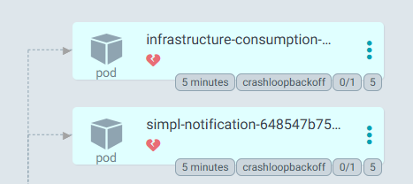
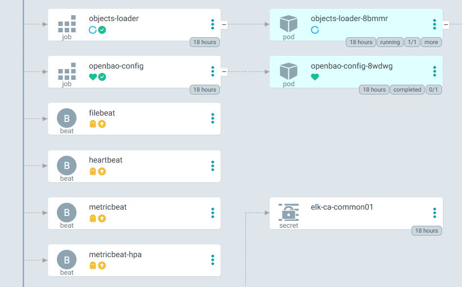
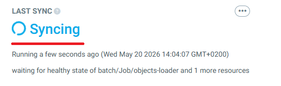
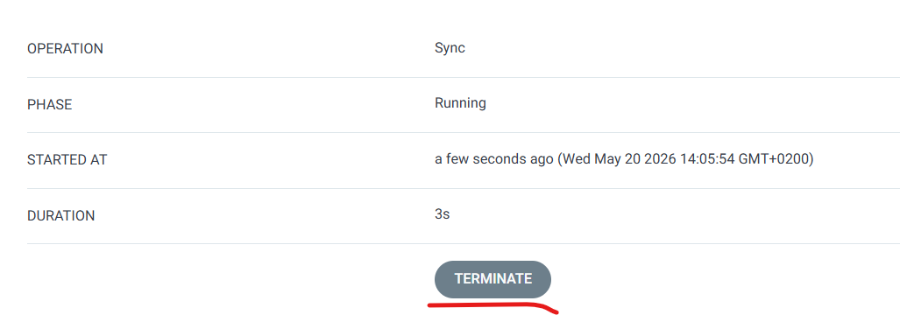
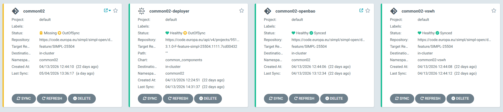
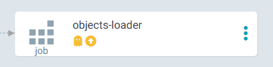

# SIMPL-Open Middleware — Common Components Deployment Guide

## Document Information

| | |
|---|---|
| **Scope** | Overview, prerequisites, deployment options, post-deployment tasks, and troubleshooting for the SIMPL-Open Middleware Common Components. |
| **Audience** | Platform engineers and DevOps engineers responsible for deploying and operating the Common Components on Kubernetes. |

---

<!-- TOC -->
- [Description](#description)
- [Component Chart Sources](#component-chart-sources)
- [Prerequisites](#prerequisites)
  - [Tools](#tools)
  - [DNS Entries](#dns-entries)
  - [Custom self signed CA](#custom-self-signed-ca)
  - [OIDC providers](#oidc-providers)
- [Deployment](#deployment)
- [Additional Steps and Remarks](#additional-steps-and-remarks)
  - [Failing Pod Restart](#failing-pod-restart)
  - [Monitoring](#monitoring)
  - [OpenBao Configuration](#openbao-configuration)
- [Sanity check](#sanity-check)
- [Troubleshooting](#troubleshooting)
- [Glossary](#glossary)
<!-- /TOC -->

## Description

This repository contains the configuration files required to deploy the **SIMPL-Open Middleware Common Components**. The Common Components are the foundational layer required by all other SIMPL-Open Middleware agents.

- The deployment is performed using a master Helm chart that deploys the full Common Components stack in a single step.
- The master Helm chart requires a values file for configuration. Example values are provided in the deployment guides linked below; inline comments explain each parameter.
- Templates of `values.yaml` files used in the integration environment are available under the `app-values` folder of the source code repository.

## Component Chart Sources

The master Helm chart orchestrates a set of sub-charts. Individual sub-charts are not published as standalone charts in the SIMPL-Open Helm registry. If you need to install or inspect a component independently, use the sources listed below.

### Internal Charts

Hosted in the SIMPL-Open GitLab package registry.

> **Note:** The **Helm Registry** value is a Helm repository endpoint consumed by Helm/ArgoCD — it is **not** a web page and cannot be opened in a browser. To browse the chart source, use the **Repository (Chart Directory)** link instead.

| Name | Chart | Description | Helm Registry (Helm/ArgoCD only, not browsable) | Repository (Chart Directory) |
|---|---|---|---|---|
| openbao-init | `openbao-init` | Initialises OpenBao after deployment (unsealing, secret engine setup) | `https://code.europa.eu/api/v4/projects/1347/packages/helm/stable` | [View chart source](https://code.europa.eu/simpl/simpl-open/development/common-components/openbao-init/-/tree/main/charts) |
| openbao-config | `openbao-config` | Configures OpenBao policies, roles, and secrets for the stack | `https://code.europa.eu/api/v4/projects/1258/packages/helm/stable` | [View chart source](https://code.europa.eu/simpl/simpl-open/development/common-components/openbao/-/tree/main/charts) |
| eck-monitoring | `eck-monitoring` | ELK/ECK monitoring stack (Elasticsearch, Kibana, Logstash, Metricbeat, Filebeat) | `https://code.europa.eu/api/v4/projects/828/packages/helm/stable` | [View chart source](https://code.europa.eu/simpl/simpl-open/development/monitoring/eck-monitoring/-/tree/main/charts) |
| kafka | `kafka` | Kafka message broker deployment (Confluent/KRaft mode) | `https://code.europa.eu/api/v4/projects/976/packages/helm/stable` | [View chart source](https://code.europa.eu/simpl/simpl-open/development/common-components/kafka/-/tree/main/charts) |
| pg-cluster | `pg-cluster` | PostgreSQL cluster managed by the Zalando Postgres Operator | `https://code.europa.eu/api/v4/projects/1024/packages/helm/stable` | [View chart source](https://code.europa.eu/simpl/simpl-open/development/common-components/postgres-cluster/-/tree/main/charts) |
| simpl-notification-service | `simpl-notification-service` | SIMPL-Open internal notification service | `https://code.europa.eu/api/v4/projects/1002/packages/helm/stable` | [View chart source](https://code.europa.eu/simpl/simpl-open/development/contract-billing/notification-service/-/tree/main/charts) |
| infrastructure-consumption-monitoring-service | `infrastructure-consumption-monitoring-service` | Monitors infrastructure resource consumption | `https://code.europa.eu/api/v4/projects/1240/packages/helm/stable` | [View chart source](https://code.europa.eu/simpl/simpl-open/development/monitoring/infrastructure-consumption-monitoring-service/-/tree/main/charts) |

### External Charts

Publicly available third-party charts. These can be installed independently using the `helm repo add` and `helm install` commands.

| Name | Chart | Description | Chart Repository |
|---|---|---|---|
| OpenBao | `openbao/openbao` | Open-source secrets management (fork of HashiCorp Vault) | [openbao.github.io/openbao-helm](https://openbao.github.io/openbao-helm) |
| ECK Operator | `elastic/eck-operator` | Elastic Cloud on Kubernetes — manages Elasticsearch, Kibana, and related resources | [helm.elastic.co](https://helm.elastic.co) |
| Vault Secrets Webhook | `bank-vaults/vault-secrets-webhook` | Kubernetes mutating webhook that injects secrets from OpenBao into pods | [ghcr.io/bank-vaults/helm-charts](https://github.com/bank-vaults/vault-secrets-webhook) |
| Confluent for Kubernetes | `confluent/confluent-for-kubernetes` | Operator for deploying and managing Confluent/Kafka components | [packages.confluent.io/helm](https://packages.confluent.io/helm) |
| Redpanda Console | `redpanda/console` | Web UI for inspecting and managing Kafka topics and consumer groups | [charts.redpanda.com](https://charts.redpanda.com) |
| Postgres Operator | `postgres-operator/postgres-operator` | Zalando Postgres Operator — manages PostgreSQL clusters on Kubernetes | [opensource.zalando.com](https://opensource.zalando.com/postgres-operator/charts/postgres-operator) |
| pgAdmin 4 | `runix/pgadmin4` | Web-based PostgreSQL administration and query tool | [helm.runix.net](https://helm.runix.net) |
| Mailpit | `jouve/mailpit` | Mock SMTP server for capturing and inspecting outgoing emails in non-production environments | [jouve.github.io/charts](https://jouve.github.io/charts/) |

## Prerequisites

### Tools

The requirements tools are listed here: [Tools requirements](https://code.europa.eu/simpl/simpl-open/cross-cutting/documentation/installation-guide/-/blob/main/Prerequisites.md?ref_type=heads#tools-requirements)

| Tool                |     Version      |   Type    | Description                                                                                                                                                                      |
|---------------------|:----------------:|:---------:|----------------------------------------------------------------------------------------------------------------------------------------------------------------------------------|
| kube-state-metrics  | 2.18.x or newer  | Mandatory | Monitoring and Metricbeat statuses in Kibana. For OVH provider it's pre-installed when cluster is deployed. Image: registry.k8s.io/kube-state-metrics/kube-state-metrics:v2.18.0 |

### DNS Entries

| Component | FQDN Pattern | Public IP |
|---|---|---|
| elastic-apm-server | `apm.{namespaceTag}.{domainSuffix}` | Default Ingress Controller Public IP |
| elastic-elasticsearch-http-public | `elasticsearch.{namespaceTag}.{domainSuffix}`  | Default Ingress Controller Public IP |
| elastic-kibana-dashboard | `kibana.{namespaceTag}.{domainSuffix}`  | Default Ingress Controller Public IP |
| elastic-otel-collector | `collector.{namespaceTag}.{domainSuffix}`  | Default Ingress Controller Public IP |
| logstash-api-beats | `logstash.beats.{namespaceTag}.{domainSuffix}`  | Default Ingress Controller Public IP |
| mailpit-{namespaceTag} | `mailpit.{namespaceTag}.{domainSuffix}`  | Default Ingress Controller Public IP |
| pg-admin-{namespaceTag} | `pgadmin.{namespaceTag}.{domainSuffix}`  | Default Ingress Controller Public IP |
| redpanda | `redpanda.{namespaceTag}.{domainSuffix}`  | Default Ingress Controller Public IP |
| openbao-{namespaceTag} | `secrets.{namespaceTag}.{domainSuffix}`  | Default Ingress Controller Public IP |
|	elastic-kibana-pdf-export | `kibana-pdf-export.{namespaceTag}.{domainSuffix}`  | Default Ingress Controller Public IP |

If your Ingress Controller is **nginx** and installed into namespace **ingress-nginx**, you can retrieve its public IP using:

```bash
kubectl get svc ingress-nginx-controller -n ingress-nginx -o jsonpath='{.status.loadBalancer.ingress[0].ip}'
```

While we recommend strongly to use **external-dns** to manage your DNS entries using automation, one could achieve a manual DNS setup.

Here is a proposed implementation of manual DNS configuration:

- Create an `A` record using `{namespace}.{domainSuffix}` pointing to the public IP of the Ingress Controller
- For each entry in the above table, create a `CNAME` record using value of *FQDN Pattern* column pointing to `{namespace}.{domainSuffix}`

### Custom self signed CA

During deployment ELK stack helm may create custom self signed Certificate of Authority. This CA is used to sign CA certificate which in next steps sign cerificates for internal communication in ELK stack. If parameter **clusterIssuer_internal** is definied, then HELM will create self signed CA with name: `{clusterIssuer_internal}-ca-{namespace}` , otherwise helm will use **dev-selfsigned** Certificate of Authority to sign CA certificate.

### OIDC providers

OpenBao integration within Simpl-Open is tested against vanilla Kubernetes clusters without any OIDC auth provider configured, any configured OIDC auth providers may work but have not been tested.

## Deployment

The Common Components can be deployed using by adding the deployer Application resource in the ArgoCD graphical interface. It's described in [ARGOCD_DEPLOYMENT.md](documents/deployment-guide/ARGOCD_DEPLOYMENT.md) file.

## Additional Steps and Remarks

### Failing Pod Restart

The following two pods depend on information from OpenBao and may start before OpenBao is fully available. If they are failing, restart them after OpenBao is up:



Although rare, this condition may recur.

### Monitoring not being deployed

You might observe a case when objects-loader pod is in progressing state for a long time, but the monitoring components aren't synced:



This is because objects-loader needs the monitoring components to work. If that happens, terminate the sync and trigger it again. 




### Monitoring

The ELK stack for monitoring is included with this release. Its deployment can be disabled by setting `monitoring.enabled` to `false`.

When enabled, access the Kibana dashboard at: `https://kibana.{namespaceTag}.{domainSuffix}`

Default credentials:
- **Username:** `elastic`
- **Password:** Retrieve with:

```bash
kubectl get secret elastic-elasticsearch-es-elastic-user -o go-template='{{.data.elastic | base64decode}}' -n <namespace>
```

### OpenBao Configuration

The description of configuring and using OpenBao is in a separate document:
<https://code.europa.eu/simpl/simpl-open/development/agents/common_components/-/blob/main/documents/user-manual/Using_OpenBao.md>

Please read this document before proceeding to install and configure other SIMPL-Open agents.

## Troubleshooting

If you encounter issues during deployment, verify the following:

- ArgoCD is properly set up and running.
- The target namespace exists in your Kubernetes cluster.
- Review the ArgoCD Application logs and Helm error messages for specific issues.
- All [DNS entries](#dns-entries) resolve correctly to the ingress controller.

## Sanity check

To make sure that everything is running correctly, you can check the statuses of apps in ArgoCD.<br><br>


Normally, every app should have a healthy status, but at the moment there are exceptions:
- common application can get a "Missing" status, because of objects-loader job which is removed after it's been processed. 


This will be fixed in future releases.

## Glossary

| Term | Definition |
|---|---|
| **ArgoCD** | A GitOps continuous delivery tool for Kubernetes that synchronises application state from a Git repository or Helm registry. |
| **Helm** | The package manager for Kubernetes, using charts to define, install, and upgrade applications. |
| **Master Helm Chart** | A top-level chart that orchestrates the deployment of multiple sub-charts as a single unit. |
| **namespaceTag** | An identifier used in Kubernetes namespace names and DNS entries to distinguish deployments. |
| **domainSuffix** | The base domain name appended to generated DNS entries (e.g. `example.com`). |
| **FQDN** | Fully Qualified Domain Name — the complete DNS name for a service. |
| **OpenBao** | An open-source secrets management tool (fork of HashiCorp Vault) used to store and access sensitive configuration. |
| **KV Secret Engine** | A key-value secret storage backend in OpenBao / Vault. |
| **cert-manager** | A Kubernetes add-on that automates the management and issuance of TLS certificates. |
| **nginx-ingress** | An ingress controller that manages external access to services in a Kubernetes cluster. |
| **kube-state-metrics** | A Kubernetes service that generates metrics about the state of objects (pods, deployments, etc.). |
| **Redpanda** | A Kafka-compatible streaming data platform used as the message broker in SIMPL-Open. |
| **ELK Stack** | Elasticsearch, Logstash, and Kibana — used for log aggregation, processing, and visualisation. |
