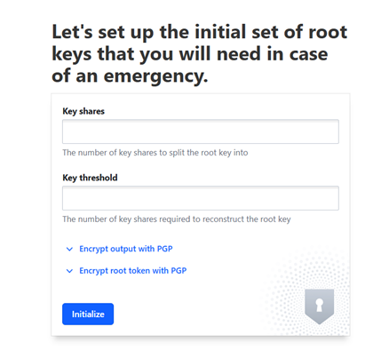
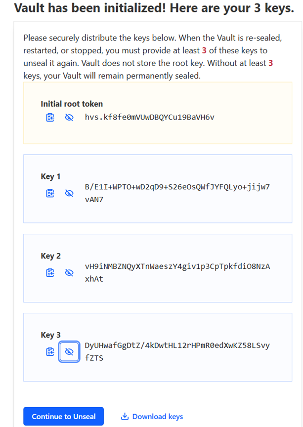
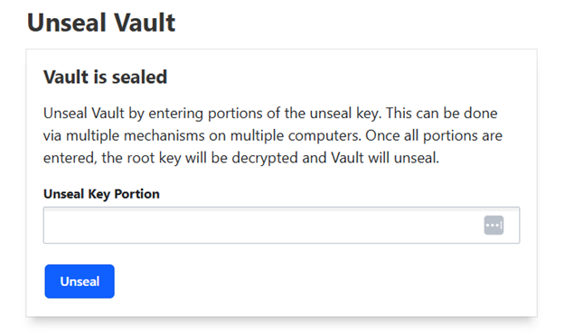
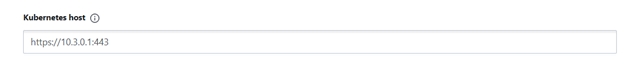
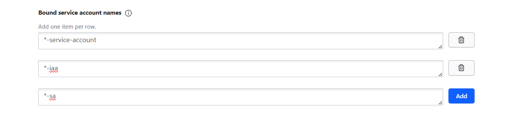
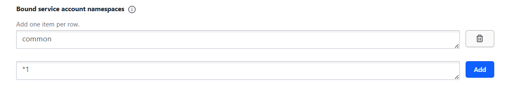
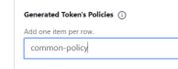
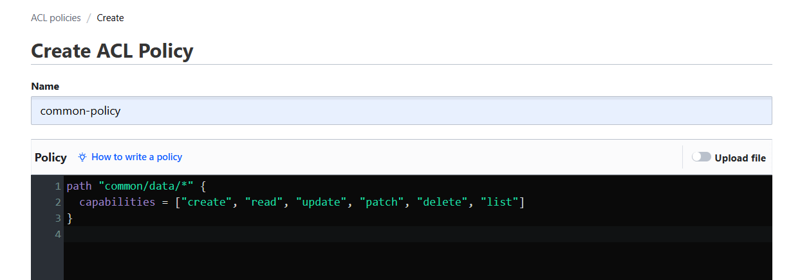

# Common components repo

## Description
This project contains the configuration files required for deploying an application using Helm and ArgoCD. 
- the deployment will be done by master helm chart allowing to deploy **Common components** using a single command.
- templates of values.yaml files used inside *Integration* environment under `app-values` folder

## Pre-Requisites

Ensure you have the following tools installed before starting the deployment process:
- Git
- Helm
- Kubectl

Additionally, ensure you have access to a Kubernetes cluster where ArgoCD is installed.

The following versions of the elements will be used in the process:

| Pre-Requisites         |     Version     | Description                                                                                                                                     |
| ---------------------- |     :-----:     | ----------------------------------------------------------------------------------------------------------------------------------------------- |
| DNS sub-domain name    |       N/A       | This domain will be used to address all services of the agent. <br/> example: `*.authority1.int.simpl-europe.eu`                            |  
| Kubernetes Cluster     | 1.29.x or newer | Other version *might* work but tests were performed using 1.29.x version                                                                        |
| nginx-ingress          | 1.10.x or newer | Used as ingress controller. <br/> Other version *might* work but tests were performed using 1.10.x version. <br/> Image used: `registry.k8s.io/ingress-nginx/controller:v1.10.0`  |
| cert-manager           | 1.15.x or newer | Used for automatic cert management. <br/> Other version *might* work but tests were performed using 1.15.x version. <br/> Image used: `quay.io/jetstack/cert-manager-controller::v1.15.3` |
| argocd                 | 2.11.x or newer | Used as GitOps tool . App of apps concept. <br/> Other version *might* work but tests were performed using 2.11.x version. <br/> Image used: `quay.io/argoproj/argocd:v2.11.3` |
| kube-state-metrics  | 2.13.x or newer | Used for monitoring, Metricbeat statuses in Kibana dashboard    |

## Installation

### Prerequisites

#### Create the Namespace
Once the namespace variable is set, you can create the namespace using the following kubectl command:

`kubectl create namespace common`

#### Verify the Namespace
To ensure that the namespace was created successfully, run the following command:

`kubectl get namespaces`
<br/>This will list all the namespaces in your cluster, and you should see the one you just created listed.

### Deployment using ArgoCD

You can easily deploy the agent using ArgoCD. All the values mentioned in the sections below you can input in ArgoCD deployment. The repoURL gets the package directly from code.europa.eu.
targetRevision is the package version. 

```
apiVersion: argoproj.io/v1alpha1
kind: Application
metadata:
  name: 'common-deployer'                           # name of the deploying app in argocd
spec:
  project: default
  source:
    repoURL: 'https://code.europa.eu/api/v4/projects/951/packages/helm/stable'
    path: '""'
    targetRevision: 1.1.2                           # version of package
    helm:
      values: |
        values:
          branch: v1.1.2                            # branch of repo with values 
        project: default                            # Project to which the namespace is attached
        namespaceTag: common                        # identifier of deployment and part of fqdn
        domainSuffix: int.simpl-europe.eu           # last part of fqdn
        argocd:
          appname: common                           # name of generated argocd app 
          namespace: argocd                         # namespace of your argocd
        cluster:
          address: https://kubernetes.default.svc
          namespace: common                         # where the app will be deployedsvc
          issuer: dev-prod                          # issuer of certificate
          kubeStateHost: kube-prometheus-stack-kube-state-metrics.devsecopstools.svc.cluster.local:8080    # link to kube-state-metrics svc
        hashicorp:
          service: "http://vault-common.common.svc.cluster.local:8200"      # link to vault that is also deployed by this chart - replace "common" if needed in both places
          secretEngine: dev-int                     # name of the kv secret engine you'll create in vault
          role: dev-int-role                        # name of the role you'll create in vault
        monitoring:
          operator:
            managedNamespaces: "common,authority,dataprovider,consumer"     # list namespaces with agents in your cluster
        kafka:
          topic:
            autocreate: true                        # set to true if kafka should automatically create topics
    chart: common_components                        # chart name
  destination:
    server: 'https://kubernetes.default.svc'
    namespace: common                               # where the package will be deployed
```

### Manual deployment

##### Files preparation

Another way for deployment, is to unpack the released package to a folder on a host where you have kubectl and helm available and configured. 

There is basically one file that you need to modify - values.yaml. 
There are a couple of variables you need to replace - described below. The rest you don't need to change.

```
values:
  branch: v1.1.2                            # branch of repo with values 

project: default                            # Project to which the namespace is attached

namespaceTag: common                        # identifier of deployment and part of fqdn
domainSuffix: int.simpl-europe.eu           # last part of fqdn

argocd:
  appname: common                           # name of generated argocd app 
  namespace: argocd                         # namespace of your argocd

cluster:
  address: https://kubernetes.default.svc
  namespace: common                         # where the app will be deployedsvc
  issuer: dev-prod                          # issuer of certificate
  kubeStateHost: kube-prometheus-stack-kube-state-metrics.devsecopstools.svc.cluster.local:8080    # link to kube-state-metrics svc

hashicorp:
  service: "http://vault-common.common.svc.cluster.local:8200"      # link to vault that is also deployed by this chart - replace "common" if needed in both places
  secretEngine: dev-int                     # name of the kv secret engine you'll create in vault
  role: dev-int-role                        # name of the role you'll create in vault

monitoring:
  operator:
    managedNamespaces: "common,authority,dataprovider,consumer"     # list namespaces with agents in your cluster

kafka:
  topic:
    autocreate: true                        # set to true if kafka should automatically create topics
```

##### Deployment

After you have prepared the values file, you can start the deployment. 
Use the command prompt. Proceed to the folder where you have the Chart.yaml file and execute the following command. The dot at the end is crucial - it points to current folder to look for the chart. 

Now you can deploy the agent:

`helm install common . `

### Monitoring

ELK stack for monitoring is added with this release.  
Its deployment can be disabled by switch the value monitoring.enabled to false.  
When it's enabled, after the stack is deployed, you can access the ELK stack UI by https://kibana.**namespacetag**.**domainsuffix**  
Default user is "elastic", its password can be extracted by kubectl command. `kubectl get secret elastic-elasticsearch-es-elastic-user -o go-template='{{.data.elastic | base64decode}}' -n {namespace}`


### Vault Configuration ###

After deploying common-tools namespace , vault instance has to be properly configured

1. Unseal Vault

Port forward vault service to local port 8300 using kubectl:
kubectl -n [namespace] port-forward svc/vault 8300:8200
http://localhost:8300/


You will be greeted with key setup page. Enter the number of Key shares and Key threshold (for example: three). 



Three keys and a root token will be provided. It is important to save all keys for possible future unseals. Root token has to be saved too, it’s used as an auth token to enter vault. Keys can also be downloaded  as a file.
Click “Continue to Unseal” 



Enter all generated keys into the text box. The vault will unseal .



Login with root token

Create secret engine
1. Got to Secrets Engines (in the menu on the left) -> Enable new engine
2. Select “Generic kv” from the list
3. Change path to “common”
4. Enable Engine

Setup Kubernetes Authentication method 
1.	Go  to Access -> Authentication Methods -> Enable new method
2.	Select Kubernetes from the list
3.	Leave path as default (“kubernetes”)
4.	In Configure Kubernetes enter Kubernetes host: https://10.3.0.1:443
<p align="left">

</p>
5.	Save Configuration

Configure common-role
1.	Go to Access -> Authentication Methods -> Kuberntes 
2.	Create role
3.	Enter the following values:

Set role name to : “common-role”
Alias name source – set to : “serviceaccount_uid”

Bound service account names -  these are service account names that will be able to access common-role.
It is required to add the roles as below, one item per row.
<p align="left">

 </p>
Bound service account namespaces: -  these are the namespaces that will be able to access to access common-role
The names of namespaces created on the environment have to be put here. (For example *1 will add all namespaces ending with "1")
<p align="left">

 </p>
Drop down tokens  on the bottom of the page:
Input “common-policy” in Generated Token’s Policies
<p align="left">

 </p>

Configure access – policy
1.	Go to policies -> ACL policies -> Create ACL Policy 
2.	Set policy name to “common-policy”
3.	Input capabilities for common/data path:

path "common/data/*" {
  capabilities = ["create", "read", "update", "patch", "delete", "list"]
}

<p align="left">

 </p>

#### Secret for Kafka

One secret is needed, its naming syntax is {{ .Release.Namespace }}-kafka-credentials, it should be created in created before kv secret engine.
Its content is:

```
{
  "redpanda": "redpanda",
  "user1": "password1",
  "user2": "password2",
  "user2": "password2",
}
```
Redpanda user is used for communication with kafka UI. The rest you can set up as needed - one is necessary for Crossplane for example. 
After you update the secret, you need to restart the kafka StatefulSet. 