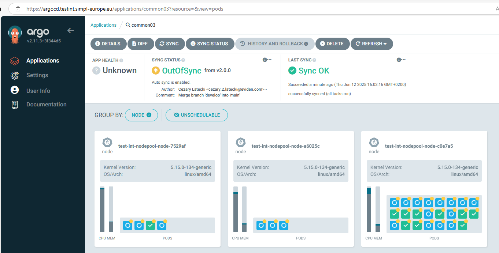
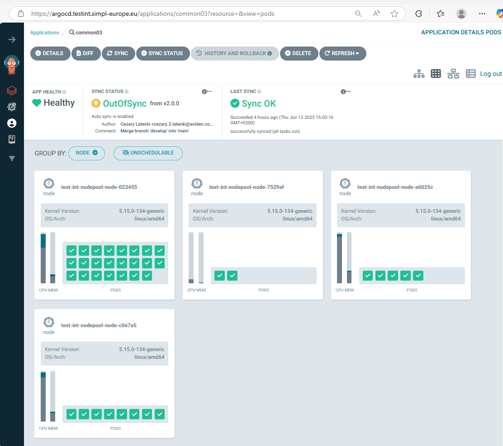
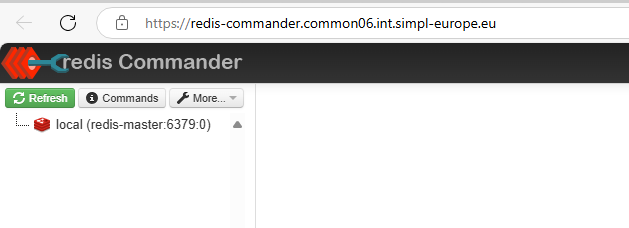
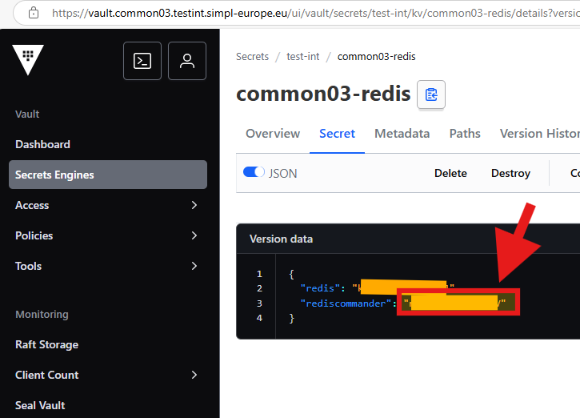
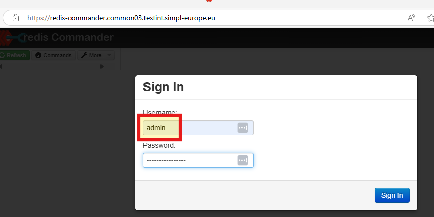

# Common Components Agent

<!-- TOC -->
* [Common Components Agent](#common-components-agent)
  * [Description](#description)
  * [Pre-Requisites](#pre-requisites)
    * [Tools](#tools)
  * [Installation](#installation)
    * [Prerequisites](#prerequisites)
      * [Create the Namespace](#create-the-namespace)
    * [Deployment using ArgoCD](#deployment-using-argocd)
    * [Manual deployment](#manual-deployment)
      * [Files preparation](#files-preparation)
      * [Deployment](#deployment)
    * [Monitoring](#monitoring)
* [Troubleshooting](#troubleshooting)
<!-- TOC -->

## Description
This project contains the configuration files required for deploying an application using Helm and ArgoCD. 
- the deployment will be done by master helm chart allowing to deploy **Common components** using a single command.
- templates of values.yaml files used inside *Integration* environment under `app-values` folder

## Pre-Requisites

Ensure you have the following tools installed before starting the deployment process:
- Git
- Helm
- Kubectl

Additionally, ensure you have access to a Kubernetes cluster where ArgoCD is installed.

The following versions of the elements will be used in the process:

| Pre-Requisites         |     Version     | Description                                                                                                                                     |
| ---------------------- |     :-----:     | ----------------------------------------------------------------------------------------------------------------------------------------------- |
| DNS sub-domain name    |       N/A       | This domain will be used to address all services of the agent. <br/> example: `*.common03.testint.simpl-europe.eu` | 
| external-dns    | bitnami/external-dns:0.16.1 | Currently version docker.io/bitnami/external-dns:0.16.1-debian-12-r should be used as externaldns. Unfortunately, using a newer version caused DNS to work incorrectly. |  
| Kubernetes Cluster     | 1.29.x or newer | Other version *might* work but tests were performed using 1.29.x version                                                                        |
| nginx-ingress          | 1.10.x or newer | Used as ingress controller. <br/> Other version *might* work but tests were performed using 1.10.x version. <br/> Image used: `registry.k8s.io/ingress-nginx/controller:v1.10.0`  |
| cert-manager           | 1.15.x or newer | Used for automatic cert management. <br/> Other version *might* work but tests were performed using 1.15.x version. <br/> Image used: `quay.io/jetstack/cert-manager-controller:v1.15.3` |
| argocd                 | 2.11.x or newer | Used as GitOps tool . App of apps concept. <br/> Other version *might* work but tests were performed using 2.11.x version. <br/> Image used: `quay.io/argoproj/argocd:v2.11.3` |
| kube-state-metrics  | 2.13.x or newer | Used for monitoring, Metricbeat statuses in Kibana dashboard    |

## DNS entries 

| Entry Name | Entries |
| ------------- | --------------------------------------------------------------------------------------------------- |
| elastic-apm-server | apm.(namespace).int.simpl-europe.eu 
| elastic-elasticsearch-http| elastic-elasticsearch-es-http.(namespace).svc
| elastic-elasticsearch-http-public	 | elasticsearch.(namespace).int.simpl-europe.eu
| elastic-kibana-dashboard | kibana.(namespace).int.simpl-europe.eu  
| elastic-otel-collector | collector.(namespace).int.simpl-europe.euusers-roles 
| logstash-api-beats | logstash.beats.(namespace).int.simpl-europe.eu
| mailpit-(namespace)	 | mailpit.(namespace).int.simpl-europe.eu
| pg-admin-(namespace)		 | pgadmin.(namespace).int.simpl-europe.eu
| redis-commander		 | redis-commander.(namespace).int.simpl-europe.eu
| redpanda	 | redpanda.(namespace).int.simpl-europe.eu
| vault	 | vault.(namespace).int.simpl-europe.eu

## Installation

### Prerequisites

### Deployment using ArgoCD

You can easily deploy the agent using ArgoCD. All the values mentioned in the sections below you can input in ArgoCD deployment. The repoURL gets the package directly from code.europa.eu.
"targetRevision" is the package version. 

In the example below, please replace the marked versions with the ones applicable to your environment.

Please pay special attention to the namespace names: common03, authority03, consumer03 and dataprovider03, and also to replace the domain name testint.simpl-europe.eu and the occurrence of the testint value itself.

```
apiVersion: argoproj.io/v1alpha1
kind: Application
metadata:
  name: 'common03-deployer'                          # name of the deploying app in argocd
spec:
  project: default
  source:
    repoURL: 'https://code.europa.eu/api/v4/projects/951/packages/helm/stable'
    path: '""'
    targetRevision: v2.1.1                          # version of package
    helm:
      values: |
        values:
          branch: v2.1.1                            # branch of repo with values
        resourcePreset: default                     # set to "low" to disable requests of resources
        agentList:                                  # list of all the agents to be deployed
          authorities:
            - authority03
          consumers:
            - consumer03
          providers:
            - dataprovider03
        project: default                            # Project to which the namespace is attached
        namespaceTag: common03                      # identifier of deployment and part of fqdn
        domainSuffix: testint.simpl-europe.eu       # last part of fqdn
        argocd:
          appname: common03                         # name of generated argocd app 
          namespace: argocd                         # namespace of your argocd
        cluster:
          address: https://kubernetes.default.svc
          namespace: common03                       # where the app will be deployed
          issuer: dev-prod                          # issuer of certificate
          kubeStateHost: kube-prometheus-stack-kube-state-metrics.devsecopstools.svc.cluster.local:8080    # link to kube-state-metrics svc
        hashicorp:
          secretEngine: test-int                    # name of the kv secret engine that will be created in vault
          role: test-int-role                       # name of the role that will be created in vault
        kafka:
          topic:
            autocreate: true                        # set to true if kafka should automatically create topics
        mailpit:
          enabled: true                             # set to true if mailpit should be deployed as mock smtp for notification service
        monitoring:
          enabled: true                             # should monitoring be enabled
    chart: common_components                        # chart name
  destination:
    server: 'https://kubernetes.default.svc'
    namespace: common03                             # where the package will be deployed

```

### Manual deployment

##### Files preparation

Another way for deployment, is to unpack the released package to a folder on a host where you have kubectl and helm available and configured. 

There is basically one file that you need to modify - values.yaml. 
There are a couple of variables you need to replace - described below. The rest you don't need to change.

```
values:
  branch: v2.1.1                            # branch of repo with values
resourcePreset: default                     # set to "low" to disable requests of resources
agentList:                                  # list of all the agents to be deployed
  authorities:
    - authority03
  consumers:
    - consumer03
  providers:
    - dataprovider03
project: default                            # Project to which the namespace is attached
namespaceTag: common03                      # identifier of deployment and part of fqdn
domainSuffix: testint.simpl-europe.eu       # last part of fqdn
argocd:
  appname: common03                         # name of generated argocd app 
  namespace: argocd                         # namespace of your argocd
cluster:
  address: https://kubernetes.default.svc
  namespace: common03                       # where the app will be deployed
  issuer: dev-prod                          # issuer of certificate
  kubeStateHost: kube-prometheus-stack-kube-state-metrics.devsecopstools.svc.cluster.local:8080    # link to kube-state-metrics svc
hashicorp:
  secretEngine: test-int                    # name of the kv secret engine that will be created in vault
  role: test-int-role                       # name of the role that will be created in vault
kafka:
  topic:
    autocreate: true                        # set to true if kafka should automatically create topics
mailpit:
  enabled: true                             # set to true if mailpit should be deployed as mock smtp for notification service
monitoring:
  enabled: true                             # should monitoring be enabled
```

##### Deployment

After you have prepared the values file, you can start the deployment. 
Use the command prompt. Proceed to the folder where you have the Chart.yaml file and execute the following command. The dot at the end is crucial - it points to current folder to look for the chart. 

Now you can deploy the agent:

`helm install common . `


After starting the deployment synchronization process, the expected namespace will be created.


Initially, the status observed e.g. in ArgoCD will indicate the creation of new pods:

<BR>

Be patient!... Depending on the configuration, this step can take up to 30 minutes!

At the end, all pods should be created correctly:

<BR>


### Monitoring

ELK stack for monitoring is added with this release.  
Its deployment can be disabled by switch the value monitoring.enabled to false.  
When it's enabled, after the stack is deployed, you can access the ELK stack UI by https://kibana.**namespacetag**.**domainsuffix**  
Default user is "elastic", its password can be extracted by kubectl command. `kubectl get secret elastic-elasticsearch-es-elastic-user -o go-template='{{.data.elastic | base64decode}}' -n {namespace}`

### Vault Configuration

The description of configuring and using vault is in a separate document:
https://code.europa.eu/simpl/simpl-open/development/agents/common_components/-/blob/main/documents/Using_Vault.md

Please read this document before proceeding to install and configure other agents (namespaces).


### Redis-commander

Redis commander is a frontend that allows to view data stored in redis-master



The password for redis commander is stored in a secret vault in common-redis secret.

Note!!! To log in, we use the password stored in the "rediscommander" variable, but as a username, we should enter "admin" and not "rediscommander"!

<BR>
<BR>


