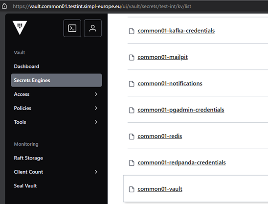
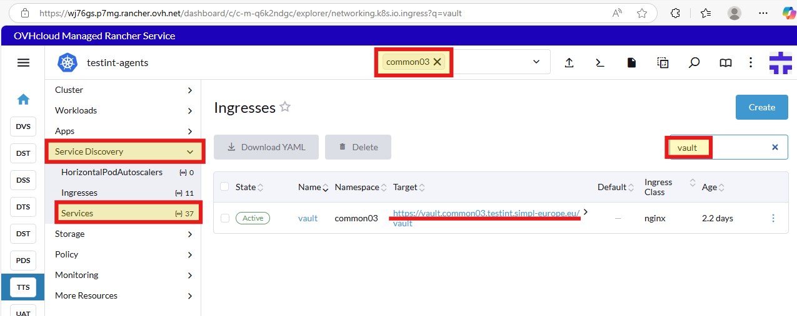
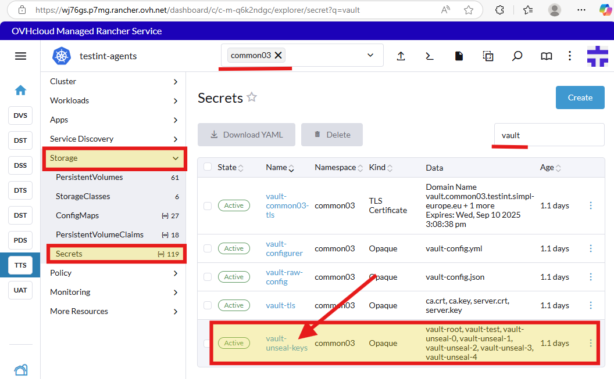
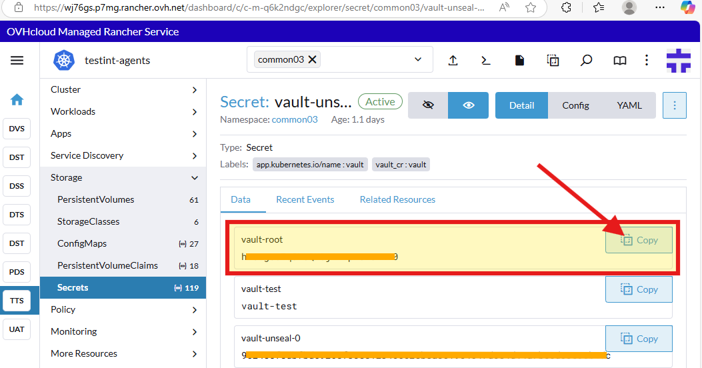
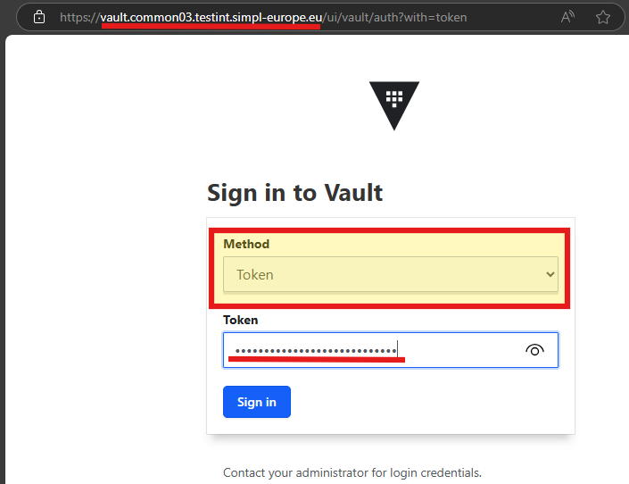
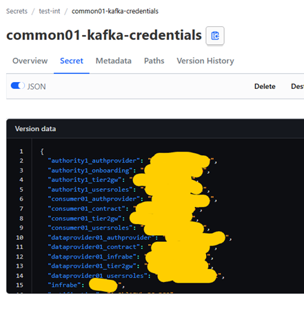

### Using Vault

In our project, we use Vault to increase security in different namespaces. Vault is a powerful tool for managing secrets, such as passwords, tokens, and encryption keys.
Additionally, our environment has been enriched with the vault-secrets-webhook module, which facilitates integration between Vault and our application.

Applications retrieve all necessary passwords, keys, and tokens from Vault based on the appropriate definitions contained in the application.yaml file.

**_IMPORTANT_**: **dataprovider_namespace**-gitea secret is not in use as Gitea credential yet.

Example entries in Vaults look like this:

**_As an update from previous version, most of the Vault configuration is now applied automatically.
You just need to create a key for Signer and update a couple of values, which is mentioned in other agents readmes._**

**_All the credentials (for Keycloak and other components) are also now automatically stored in Vault - review the secrets for credentials if needed._**

You can access vault on https://vault.**namespacetag**.**domainsuffix**

we can always check the actual address in rancher:

 

Root token can be found in secret vault-unseal-keys, in key vault-root. 

 
 
 

The application retrieves them according to the following configuration:

The above configuration ensures that passwords and other secrets are generated securely and managed efficiently, reducing the risk of security breaches and simplifying the management of secrets across namespaces.

