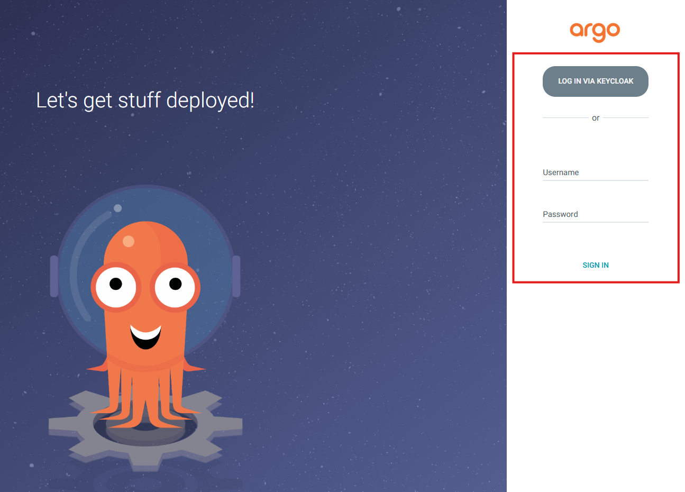
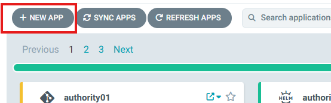
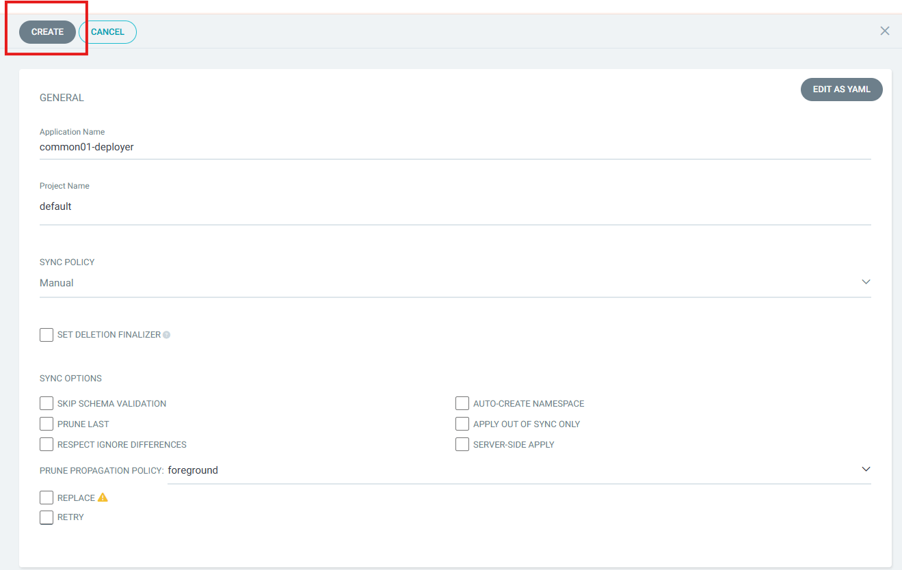
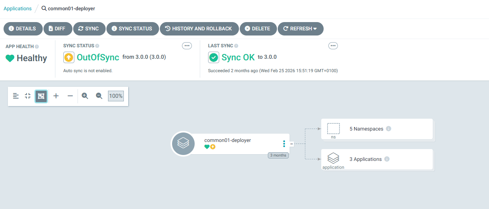

# Common Components — ArgoCD UI Deployment

## Document Information

| | |
|---|---|
| **Scope** | Step-by-step instructions for deploying the SIMPL-Open Middleware Common Components through the ArgoCD graphical interface. |
| **Audience** | Platform engineers and DevOps engineers with access to an ArgoCD instance and permissions to create Application resources. |

---

> For Helm CLI deployment, see [HELM_CLI_DEPLOYMENT.md](HELM_CLI_DEPLOYMENT.md).

## Prerequisites

Before proceeding, ensure the following requirements are met:

- **ArgoCD 3.2.x or newer** is installed and accessible.
- You have sufficient permissions to create Application resources in ArgoCD.
- The target Common Components Helm chart version has been determined and is available in the package registry.

## Deployment Procedure

Follow the steps below to deploy the Common Components through the ArgoCD UI.

### Step 1 — Log in to ArgoCD

Open the ArgoCD web interface in your browser and authenticate with your credentials. You must have permissions to create Application resources in the target project.



### Step 2 — Create a new Application

From the ArgoCD dashboard, click the **+ NEW APP** button in the top-left area of the interface.



### Step 3 — Switch to the YAML editor

In the new application creation form, click the **EDIT AS YAML** button (located in the upper-right area of the form). This opens the raw YAML editor where you can paste the full Application manifest.


### Step 4 — Paste the Application manifest

Copy the YAML manifest from the [Example ArgoCD Application manifest](#example-argocd-application-manifest) section below (after replacing all placeholder values), paste it into the YAML editor, and click **SAVE**.


### Step 5 — Verify the populated fields

After saving, ArgoCD switches back to the form view. Verify that the following fields have been correctly populated from the manifest.

If any field is empty or incorrect, click **EDIT AS YAML** again, correct the manifest, and save.



### Step 6 — Create and synchronise

Click the **CREATE** button to create the Application. ArgoCD will begin synchronising the resources to your cluster. You can monitor progress in the Application detail view.



---

## Configuration Reference

The sections below provide the full list of values that must be replaced, followed by the complete example manifest to copy into the YAML editor.

> **WARNING — All values below are example placeholders.**
> They **MUST** be replaced with values specific to your environment before deploying. Deploying with the example values as-is will fail or produce an incorrect configuration.

> **Important:** Agent names in the `agentList` value list **cannot** contain the `-` (hyphen) character.

### Values that must be replaced

| Value in example | Field(s) | What to set |
|---|---|---|
| `<common-namespace>` | `namespaceTag`, `argocd.appname`, `cluster.namespace`, `destination.namespace`, `metadata.name` | Your chosen namespace identifier for common components |
| `<authority-namespace>`, `<consumer-namespace>`, `<dataprovider-namespace>` | `agentList` entries | The actual namespace identifiers of each agent to be deployed |
| `<your-domain>` | `domainSuffix` | Your actual domain name |
| `default` | `project` | The ArgoCD project to which this deployment belongs |
| `3.1.4` / `v3.1.4` | `targetRevision`, `values.branch` | The Helm chart version and corresponding Git branch for your release |
| `default` | `resourcePreset` | Setting this value to `low`, will limit the Kubernetes requests for CPU and memory in deployed resources, if possible. It will make the agent deployable on a smaller cluster. |
| `example` | `secrets.secretEngine` | The name of the KV secret engine configured in your OpenBao |
| `example-role` | `secrets.role` | The name of the role configured in your OpenBao |
| `dev-prod` | `cluster.issuer` | Your certificate issuer name |
| `dev-selfsigned` | `cluster.internalIssuer` | Your internal/self-signed certificate issuer name |
| `kube-prometheus-stack-kube-state-metrics.devsecopstools.svc.cluster.local:8080` | `cluster.kubeStateHost` | The service address of kube-state-metrics in your cluster |
| `<common-namespace>-deployer` | `metadata.name` | Application name |
| `default` (or your chosen project) | `spec.project` | Project name |
| `https://code.europa.eu/api/v4/projects/951/packages/helm/stable` | `spec.source.repoURL` | Repository URL |
| `common_components` | `spec.source.chart` | Chart |
| `3.1.4` (your chart version) | `spec.source.targetRevision` | Target Version |
| `https://kubernetes.default.svc` | `spec.destination.server` | Cluster URL |
| Your common components namespace | `spec.destination.namespace` | Namespace |
**Fields that typically do not need changing:** `repoURL` (unless you host your own mirror), `cluster.address` (unless deploying to a remote cluster).

### Example ArgoCD Application manifest

```yaml
apiVersion: argoproj.io/v1alpha1
kind: Application
metadata:
  name: '<common-namespace>-deployer'                  # name of the deploying app in argocd
  namespace: argocd                                    # namespace of your argocd
spec:
  project: default                                     # project in which the deployer app is created
  source:
    repoURL: 'https://code.europa.eu/api/v4/projects/951/packages/helm/stable'
    path: '""'
    targetRevision: 3.1.4                              # version of package
    helm:
      values: |
        values:
          branch: v3.1.4                               # branch of repo with values
        resourcePreset: default                        # set to "low" to disable requests of resources
        agentList:                                     # list of all the agents to be deployed
          authorities:
            - <authority-namespace>
          consumers:
            - <consumer-namespace>
          providers:
            - <dataprovider-namespace>
        project: default                               # project to which the namespace is attached
        namespaceTag: <common-namespace>               # identifier of deployment and part of fqdn
        domainSuffix: <your-domain>                    # last part of fqdn
        argocd:
          appname: <common-namespace>                  # name of generated argocd app
          namespace: argocd                            # namespace of your argocd
        cluster:
          address: https://kubernetes.default.svc      # FQDN of your kubernetes cluster
          namespace: <common-namespace>                # where the app will be deployed
          issuer: <your-issuer>                        # issuer of certificate
          internalIssuer: dev-selfsigned               # issuer of self-signed certificates
          kubeStateHost: kube-prometheus-stack-kube-state-metrics.devsecopstools.svc.cluster.local:8080
        secrets:
          role: <role_name>                           # role created in OpenBao for access (this value must be defined per environment)
          secretEngine: <secret_engine_name>          # container for secrets in your OpenBao (this value must be defined per environment)
        kafka:
          ha: true                                     # true creates 3 replicas of each component, false creates 1 of each
          topic:
            autocreate: true                           # set to true to have kafka creating automatically the required topics
        mailpit:
          enabled: true                                # set to true to enable the Mailpit app deployment as mock SMTP server
        monitoring:
          enabled: true                                # set to true to enable the monitoring features
        redpanda:
          enabled: true                                # set to true to enable the Redpanda - Kafka UI app deployment
        pg_admin:
          enabled: true                                # set to true to enable the Postgres Admin app deployment
        pg_cluster:
          ha: true                                     # set to false to have one replica of Postgres to save resources
        openbao:
          ha: true                                     # set to false to have one replica of OpenBao to save resources
    chart: common_components
  destination:
    server: 'https://kubernetes.default.svc'           # FQDN of your kubernetes cluster
    namespace: <common-namespace>                      # where the Common Components will be deployed
```

To limit the resource usage you can switch the following keys to those values:

| Field | What to set | Description |
|---|---|---|
| `resourcePreset` | `low` | Disables requests for CPU and MEM |
| `kafka.ha` | `false` | Switches from 3 replicas of Kafka to 1 |
| `pg_cluster.ha` | `false` | Switches from 3 replicas of Postgres to 1 |
| `openbao.ha` | `false` | Switches from 3 replicas of OpenBao to 1 |

Also, additionally to what is described in the snippet above, all of the following apps deployment can be disabled, but it will affect out-of-the-box functionality. 
To do so, add the following keys to with value "false" in spec.source.helm.values:

| Field | Description |
|---|---|
| `openbao.enabled` | Disable OpenBao |
| `openbao_init.enabled` | Disable OpenBao unseal scripts |
| `openbao_config.enabled` | Disable OpenBao config scripts |
| `vault_webhook.enabled` | Disable webhook pulling passwords from OpenBao |
| `confluent_operator.enabled` | Disable Kafka operator |
| `kafka.enabled` | Disable Kafka |
| `pg_operator.enabled` | Disable Postgres Operator |
| `pg_cluster.enabled` | Disable Postgres Cluster |
| `infrastructure_consumption_monitoring_service.enabled` | Disable Infrastructure Consumption Monitoring Service |

Depending on your Kubernetes configuration and available resources, the deployment of the Common Components can take **more than 30 minutes**. Allow sufficient time for all resources to be created and stabilise before proceeding.

## Verification

After the deployment has completed, verify that all resources are healthy:

1. **Check ArgoCD sync status.** In the ArgoCD UI, confirm that the Application shows a **Synced** status and that the health indicator is **Healthy**. If the Application is in a **Degraded** or **OutOfSync** state, review the sync details for error messages.

2. **Verify that all pods are running.** Open a terminal with `kubectl` access to the target cluster and run:

   ```bash
   kubectl get pods -n <common-namespace>
   ```

   All pods should report a `Running` or `Completed` status. Investigate any pods in `CrashLoopBackOff`, `Error`, or `Pending` states.

3. **Review pod logs for errors.** For any pod that is not healthy, inspect its logs:

   ```bash
   kubectl logs <pod-name> -n <common-namespace>
   ```

## See Also

- [Common Components Deployment Overview](README.md)
- [Helm CLI Deployment Guide](HELM_CLI_DEPLOYMENT.md)
