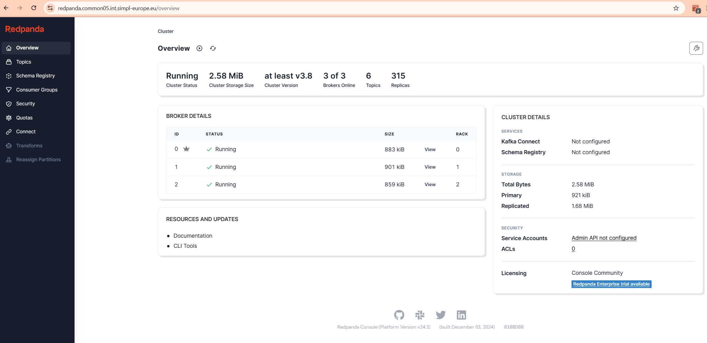
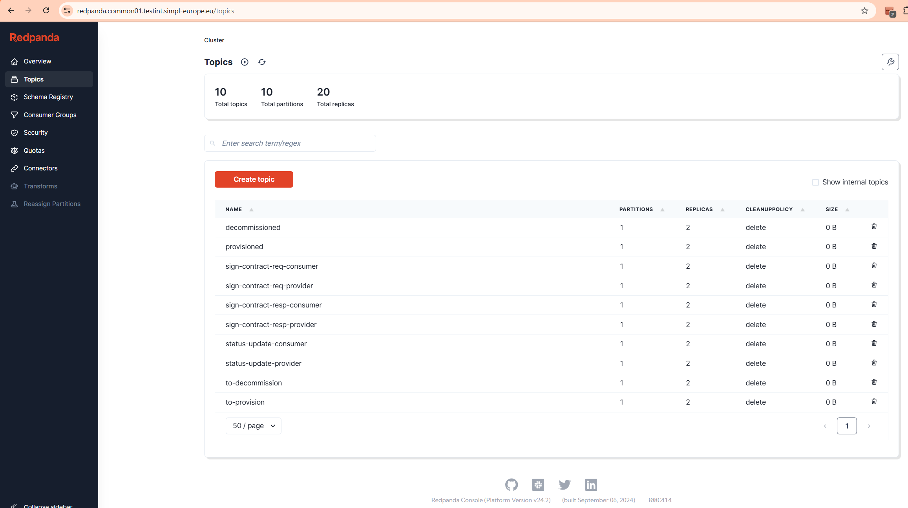
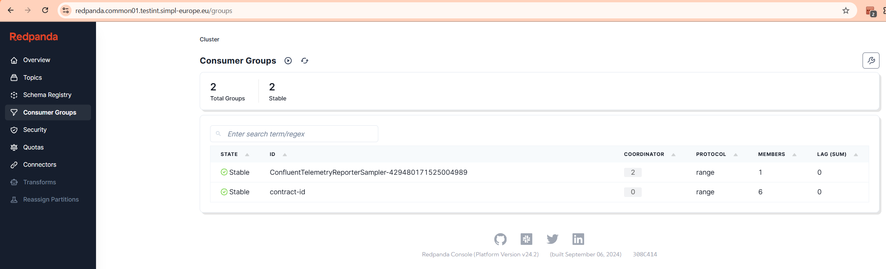
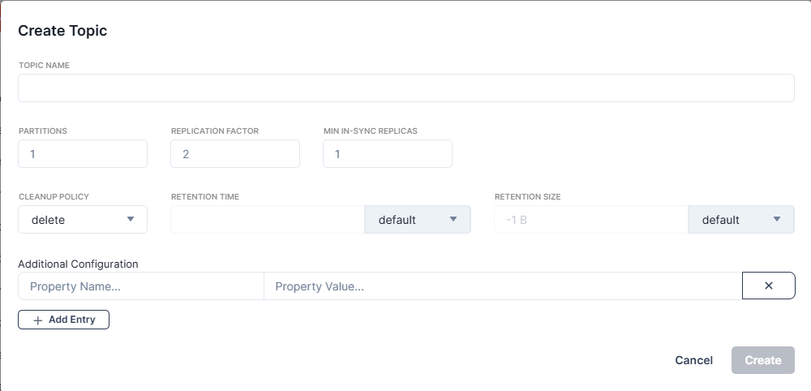

# Kafka administration

## Overview

This tool is not required for end user to the SIMPL-Middleware. It is needed for the developer of the middleware

Common Components repo includes three components that are used as Kafka stack. Those are:

* Confluent Operator, provided by a chart *confluent-for-kubernetes* from Confluent helm package repository, documentation: <https://docs.confluent.io/operator/current/overview.html>
* Kafka stack, from repository <https://code.europa.eu/simpl/simpl-open/development/common-components/kafka>
* Redpanda Console, an open source UI, provided by a chart *console* from Redpanda helm package repository, documentation: <https://docs.redpanda.com/current/console/>

Redpanda console serves as an UI to administer the Kafka stack.

### Kafka configuration

There are a couple options you can set in Kafka deployment. Below you can find a table explaining them:

| Variable name                 |     Example         | Description     |
| ----------------------        |     :-----:         | --------------- |
| kafka.image.tag               | 8.2.1  | version of kafka image |
| kafka.image.initTag           | 3.2.2  | version of kafka init container |
| kafka.replicas                | 3     | number of replicas  |
| kafka.resources               | - | resources for kafka replicas - standard syntax of requests and limits |
| kafka.topic.replicas          | 2 | number of topic replicas  |
| kafka.topic.insyncreplicas    | 1 | number of in sync replicas |
| kafka.topic.autocreate        | true | enables autocreation of topics |
| kafka.auth.enabled            | true | enables enables SASL plaintext authentication (users are defined in vault secret) |
| kafka.clusterLink             | false | enable or disable cluster link feature |
| kafka.balancer                | false | enable or disable balancer feature |
| kafka.configOverrides.server  | - | table of additional configOverrides.server |
| kafka.configOverrides.log4j   | - | table of configOverrides.log4j  |
| kafka.configOverrides.log4j2  | - | table of configOverrides.log4j2 |
| kraftController.replicas      | 3 | number of replicas of kraft controllers |
| kraftController.resources     | - | resources for kraft controllers - standard syntax of requests and limits |
| hashicorp.service             | http://vault.commonns.domainsuffix | link to vault ingress
| hashicorp.role                | accessrole_name | name of role for vault access |
| hashicorp.secretEngine        | name | secret engine name in vault |

### Redpanda Console

#### Console access

You can access the console by going to https url redpanda.*namespaceTag*.*domainSuffix*

For credentials you need to access the OpenBao, you'll find them in secret named *namespaceTag*-redpanda-credentials.

#### Console overview

After accessing the website above and entering the credentials set up with values, you will see the following screen.

Using the menu on the left, you'll be able to see topics,

Consumer groups, etc.

#### Creating Topics

By clicking "Create topic" button you are able to add topics.

The topics to be created are listed below. All topics have 1 partition, 2 replicas (with exception of contract_consumption.transfer) and cleanup policy set to delete. Retention time and size leave on default.

* 1.contract_consumption.transfer -- 1 replica only!
* 2.decommissioned
* 3.iaa.authority.eu.europa.ec.simpl.authenticationprovider.events.credential.updated
* 4.iaa.consumer.eu.europa.ec.simpl.authenticationprovider.events.credential.updated
* 5.iaa.dataprovider.eu.europa.ec.simpl.authenticationprovider.events.credential.updated
* 6.iaa.dataprovider.eu.europa.ec.simpl.authenticationprovider.events.identity-attributes.updated
* 7.notifications (if error 'TOPIC_ALREADY_EXIST' appears, you can skip this topic)
* 8.provisioned
* 9.sign-contract-req-consumer
* 10.sign-contract-req-provider
* 11.sign-contract-resp-consumer
* 12.sign-contract-resp-provider
* 13.status-update-consumer
* 14.status-update-provider
